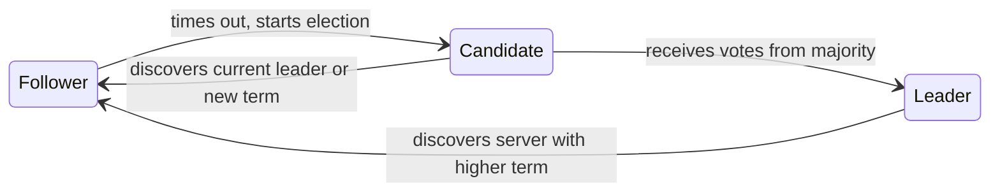
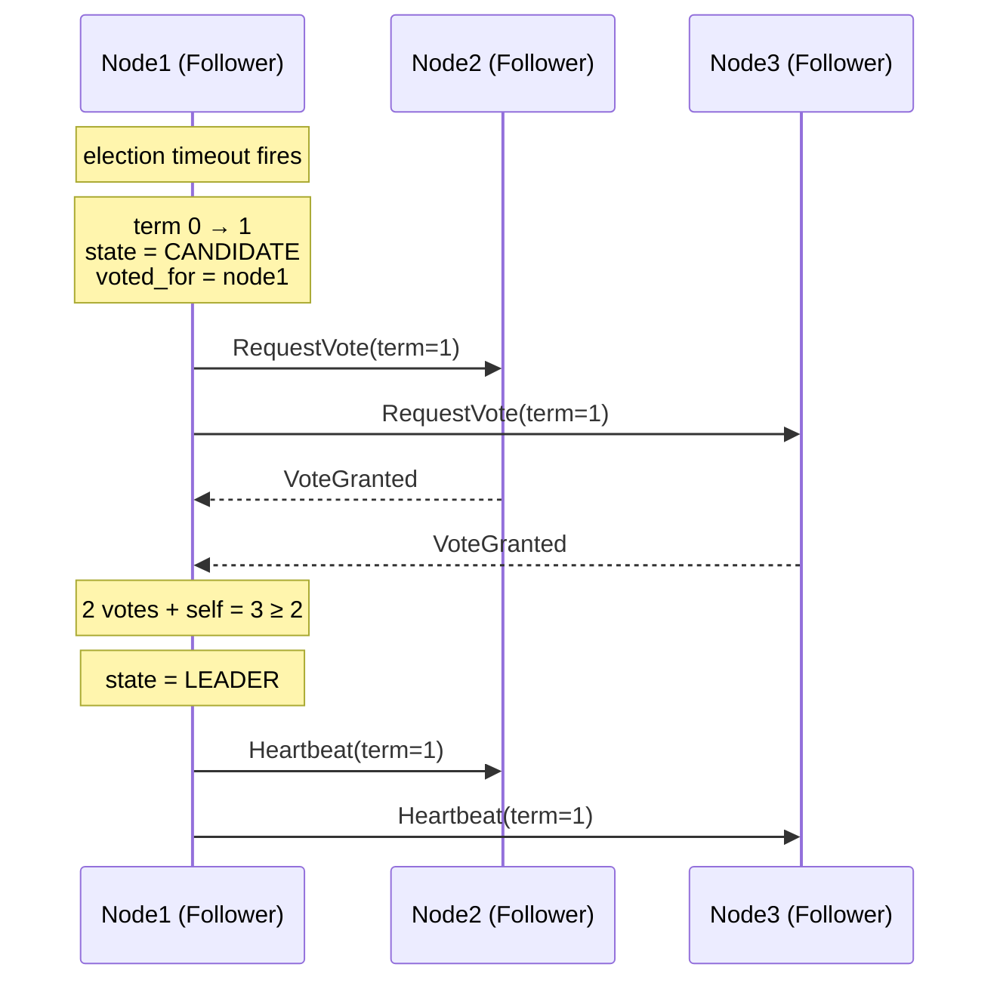

<a href="https://github.com/AlexDevFlow/raft-python" target="_blank" rel="noopener noreferrer" class="github-repo-btn"><i class="fab fa-github"></i> View on GitHub</a>

A step-by-step guide to implementing the Raft distributed consensus algorithm from scratch in pure Python, no dependencies required.

**Quick Start** (if you just want to run it):

```bash
# Launch a 3-node cluster
python3 cluster.py --nodes 3

# In another terminal, write and read data
python3 client.py --server http://127.0.0.1:8001 set greeting "hello world"
python3 client.py --server http://127.0.0.1:8001 get greeting

# Check cluster status
python3 client.py --server http://127.0.0.1:8001 status
```

---

## Table of Contents

1. [Why Consensus? The Problem We're Solving](#part-1-why-consensus-the-problem-were-solving)
2. [Setting Up the Cluster (Networking Layer)](#part-2-setting-up-the-cluster)
3. [Node States, the Term Clock, and Thread Safety](#part-3-node-states-the-term-clock-and-thread-safety)
4. [Leader Election](#part-4-leader-election)
5. [Heartbeats and Log Replication](#part-5-heartbeats-and-log-replication)
6. [Safety and Commitment Rules](#part-6-safety-and-commitment-rules)
7. [The Key-Value Store](#part-7-the-key-value-store)
8. [Persistence, Recovery, and Log Compaction](#part-8-persistence-recovery-and-log-compaction)
9. [Testing Your Raft](#part-9-testing-your-raft)
10. [Going Further](#going-further)

---

## Part 1: Why Consensus? The Problem We're Solving

A few months ago I was debugging a caching layer that ran on three servers. One server had rebooted during a deploy, came back with stale data, and happily served it. Nobody noticed because the other two servers had the correct data and healthchecks were passing.

I realized having multiple servers doesn't give you reliability by default. It gives you multiple sources of truth, which is, well, arguably worse than one.

### The Five-Server Problem

Imagine you have five servers, each holding a copy of some data. A client writes `x = 1` to server A. Then another client writes `x = 2` to server B. What's the "real" value of x?

```
Client 1 → Server A: "set x = 1" ✓
Client 2 → Server B: "set x = 2" ✓

Server A thinks x = 1
Server B thinks x = 2
Servers C, D, E: ¯\_(ツ)_/¯
```

Without coordination, you've got five independent databases pretending to be one. This is the split-brain problem, and it gets worse when networks partition: server A literally cannot talk to server B, so they both think they're the only one serving traffic.

### What Consensus Actually Means

Consensus doesn't mean every server always agrees. That's impossible: servers crash, networks drop packets, disks corrupt. Consensus means: **for any given operation, a majority of servers agree on what happened and in what order.**

If 3 out of 5 servers agree that the sequence was `[set x=1, set x=2]`, that's the truth. Even if the other 2 missed the memo. When they come back, they catch up.

The magic number is the majority: `(N/2) + 1`. With 5 nodes, you need 3 to agree. With 3 nodes, you need 2. This means you can tolerate `(N-1)/2` failures. A 5-node cluster survives 2 deaths. A 3-node cluster survives 1.

### Why Raft?

Paxos was the first widely-known consensus algorithm, published by Leslie Lamport in 1998. It's mathematically elegant and notoriously difficult to understand. The paper was originally written as a parable about a fictional Greek parliament, which is charming but makes it even harder to map to actual code.

Raft was designed by Diego Ongaro and John Ousterhout in 2014 specifically to be understandable. The name is partially an acronym ("Reliable, Replicated, Redundant, And Fault-Tolerant") and partially a reference to building a raft to escape the island of Paxos. Their key insight was simple: if you decompose consensus into three relatively independent sub-problems, each one is tractable.

I want to be clear about something: Paxos and Raft are equivalent in what they achieve. Raft isn't "better" than Paxos in terms of correctness or performance. It's better at being implemented correctly by humans. And since most distributed systems bugs come from implementation mistakes rather than protocol flaws, that matters a lot.

Those three sub-problems are:
1. **Leader election**: pick one node to be in charge
2. **Log replication**: the leader copies its log of commands to everyone else
3. **Safety**: guarantee that once a command is committed, it sticks, even through crashes and leader changes

### The State Machine Approach

Here's the mental model that makes Raft click:

<div style="display:flex;flex-direction:column;align-items:center;gap:0;margin:2rem 0;font-family:inherit;">
  <div style="background:var(--secondary-bg,#f5f0e8);border:2px solid var(--accent,#4db8b8);border-radius:8px;padding:14px 32px;text-align:center;font-size:1rem;">Clients send commands</div>
  <div style="font-size:1.5rem;line-height:1.2;">↓</div>
  <div style="background:var(--secondary-bg,#f5f0e8);border:2px solid var(--accent,#4db8b8);border-radius:8px;padding:14px 32px;text-align:center;font-size:1rem;">Raft agrees on the ORDER of commands</div>
  <div style="font-size:1.5rem;line-height:1.2;">↓</div>
  <div style="background:var(--secondary-bg,#f5f0e8);border:2px solid var(--accent,#4db8b8);border-radius:8px;padding:14px 32px;text-align:center;font-size:1rem;">Every node applies in same order</div>
  <div style="font-size:1.5rem;line-height:1.2;">↓</div>
  <div style="background:var(--secondary-bg,#f5f0e8);border:2px solid var(--accent,#4db8b8);border-radius:8px;padding:14px 32px;text-align:center;font-size:1rem;">All nodes reach the same state</div>
</div>

If all nodes start from the same initial state and apply the same commands in the same order, they'll all reach the same final state. That's it. That's the whole idea. Raft's job is just to agree on the order.

We're going to implement this as a distributed key-value store. Clients send SET/GET/DELETE commands, Raft agrees on their order, and every node applies them to a local Python dict. By the end, you'll have a working cluster you can kill nodes in and it'll keep ticking.

What surprised me building this: the core algorithm is maybe 500 lines. The majority of lines are networking, error handling, persistence, and the HTTP API. The hard part of distributed systems isn't the algorithm, rather it's everything around it.

---

## Part 2: Setting Up the Cluster

Before we can elect leaders or replicate logs, nodes need to talk to each other.

### The Wire Protocol

I went with TCP sockets and JSON messages. HTTP would have worked but adds overhead on every heartbeat (which fires every 50ms). UDP is simpler but unreliable, we'd have to build our own ack/retry layer, which is more code than just using TCP.

Every message is a JSON object, framed with a 4-byte big-endian length prefix:

```
[4 bytes: message length][JSON payload]
```

This is the standard approach for TCP protocols. You can't just use newline-delimited JSON because what if someone puts a newline in a value? Length-prefix framing is only a few lines more and it's bulletproof.

```python
# raft/rpc.py
HEADER_FMT = "!I"  # 4-byte unsigned int, big-endian
HEADER_SIZE = struct.calcsize(HEADER_FMT)

def _send_message(sock: socket.socket, message: dict) -> None:
    payload = json.dumps(message).encode("utf-8")
    header = struct.pack(HEADER_FMT, len(payload))
    sock.sendall(header + payload)

def _recv_message(sock: socket.socket) -> dict:
    header = _recv_exact(sock, HEADER_SIZE)
    msg_len = struct.unpack(HEADER_FMT, header)[0]
    payload = _recv_exact(sock, msg_len)
    return json.loads(payload.decode("utf-8"))
```

One thing that tripped me up is that `socket.recv()` can return fewer bytes than you asked for. TCP is a stream protocol: it doesn't preserve message boundaries. So you need a helper that keeps reading until you have exactly `n` bytes:

```python
def _recv_exact(sock, n):
    buf = bytearray()
    while len(buf) < n:
        chunk = sock.recv(n - len(buf))
        if not chunk:
            raise ConnectionError("connection closed")
        buf.extend(chunk)
    return bytes(buf)
```

I've seen that in basic examples they skip this and just call `sock.recv(1024)`. It works in testing because messages are small and the network is localhost, but it's a bomb waiting to explode in any other environment.

### The Three Network Classes

The networking layer has three classes that build on each other:

**`RPCServer`**: listens for incoming TCP connections. One thread runs an accept loop; each accepted connection gets its own handler thread that reads messages and dispatches them to a callback. For a 3-5 node cluster, one thread per connection is fine. A production system would use `selectors` or `asyncio`, but threads are easier to teach and debug.

The server socket uses `SO_REUSEADDR` so you can restart nodes without waiting for TCP TIME_WAIT to expire. Without this, you'd get "address already in use" errors constantly during development.

**`RPCClient`**: sends messages to a single remote peer. It uses lazy connections (the first `send()` triggers `connect()`) and automatically reconnects on failure. If a peer is down, `send()` returns `False` silently, the node never blocks waiting for a dead peer. This is important: Raft is designed to tolerate failures, so the networking layer should handle them **quietly**.

```python
class RPCClient:
    def send(self, message: dict) -> bool:
        with self._lock:
            try:
                if self._sock is None:
                    self._connect()
                _send_message(self._sock, message)
                return True
            except (OSError, ConnectionError, TypeError):
                self._close_socket()
                return False
```

**`PeerNetwork`**: a facade that wraps one `RPCClient` per peer. This is what the rest of the code talks to. The Raft node never touches TCP directly:

```python
class PeerNetwork:
    def send_to(self, peer_id: str, message: dict) -> bool:
        """Send to one peer. Returns False if they're unreachable."""
        ...

    def broadcast(self, message: dict) -> dict[str, bool]:
        """Send to all peers. Returns {peer_id: success}."""
        ...
```

This layering matters for testing. When we write unit tests in Part 9, we'll swap out `PeerNetwork` with a fake that delivers messages to an in-memory queue instead of TCP. The rest of the code doesn't know the difference.

### Running Multiple Nodes

Each node runs in its own process with a unique ID and port. Peers are specified on the command line:

```bash
# Terminal 1
python3 server.py --id node1 --port 5001 --peers node2=127.0.0.1:5002,node3=127.0.0.1:5003

# Terminal 2
python3 server.py --id node2 --port 5002 --peers node1=127.0.0.1:5001,node3=127.0.0.1:5003

# Terminal 3
python3 server.py --id node3 --port 5003 --peers node1=127.0.0.1:5001,node2=127.0.0.1:5002
```

Or just use the cluster launcher: `python3 cluster.py --nodes 3`.

**Checkpoint:** spin up 3 nodes and watch the logs: you should see them connecting to each other and starting election timers.

---

## Part 3: Node States, the Term Clock, and Thread Safety

### Three States

Every Raft node is in exactly one of three states at any time:



**Follower**: the passive state. Followers just sit there, respond to RPCs from leaders and candidates, and wait. If they don't hear from a leader for a while, they become a candidate.

**Candidate**: actively trying to become leader. Candidates ask other nodes for votes. If they get a majority, they become leader. If they hear from a leader with an equal or higher term, they step back to follower.

**Leader**: the one node that handles all client requests and pushes log entries to followers. There's at most one leader per term.

### The Term Clock

Raft doesn't use wall clocks for anything. Instead, it uses a logical clock called the **term**,  an integer that starts at 0 and only goes up. Think of terms as political terms: term 1 has a leader (or a failed election), then term 2, and so on.

Every message carries the sender's term. When a node receives a message with a higher term than its own, it immediately updates its term and becomes a follower. This is how stale leaders learn they've been replaced.

```python
def _check_term(self, msg: dict) -> bool:
    """If msg has higher term, step down. Returns True if msg is stale."""
    msg_term = msg.get("term", 0)
    if msg_term > self.current_term:
        self._step_down(msg_term)
        return False
    return msg_term < self.current_term
```

This one method is called at the top of every message handler. It's the immune system of the protocol, any node, at any time, that sees a higher term immediately defers to whatever node is operating in that term.

There's an elegant property here: terms only go up. A node never decreases its term. And since every RPC carries the sender's term, information about new terms propagates through the cluster quickly. If node 3 starts an election in term 5 while everyone else is in term 3, within one round of messages every node will be in term 5. Stale leaders discover they're stale, stale candidates give up, and the cluster converges on the current term.

One thing I got wrong initially: I wasn't calling `_check_term()` at the very beginning of every handler. I'd check it for RequestVote but forget for VoteResponse. The result was subtle: a node would process a stale vote response and incorrectly count it toward a win in the wrong term.

### Persistent vs Volatile State

This distinction matters for crash recovery. The Raft paper is very precise about what must survive a restart:

**Persistent** (saved to disk before responding to any RPC):
- `current_term` : if we forget our term, we might vote twice
- `voted_for` : same reason. Voting twice in one term can create two leaders.
- `log` : if we lose committed entries, the cluster's safety guarantee breaks

**Volatile** (rebuilt from scratch after restart):
- `commit_index` and `last_applied`: the leader will tell us what's committed
- `state`: always start as follower
- `leader_id`:  we'll learn who the leader is from the first heartbeat
- `next_index` / `match_index`: leader-only, reinitialized after each election

### The RaftNode Skeleton

```python
class RaftNode:
    def __init__(self, node_id, host, port, peers, ...):
        # Persistent state (survives crashes)
        self.current_term: int = 0
        self.voted_for: Optional[str] = None
        self.log: RaftLog = RaftLog()

        # Volatile state
        self.commit_index: int = 0
        self.last_applied: int = 0
        self.state: State = State.FOLLOWER
        self.leader_id: Optional[str] = None

        # Leader-only state (reinitialized after each election)
        self.next_index: dict[str, int] = {}
        self.match_index: dict[str, int] = {}

        # The lock
        self._lock = threading.RLock()
```

### A Sidebar on Thread Safety

This is where most Raft implementations get a lil twisted, so let me be upfront about the strategy.

We have a lot of threads: the HTTP server threads handling client requests, RPC handler threads processing messages from peers, timer threads firing election and heartbeat timeouts. They all touch the same state.

The approach: **one lock to rule them all.** A single `threading.RLock` protects every piece of mutable state in `RaftNode`. Every method that reads or writes state acquires it.

But here's the golden rule: **never hold the lock while doing network I/O.** If node A holds its lock while sending to node B, and node B holds its lock while sending to node A, you've got a deadlock.

The pattern is always:

```python
with self._lock:
    # Read state, build the message
    msg = {"type": "append_entries", "term": self.current_term, ...}

# Send OUTSIDE the lock
self.peers.send_to(peer_id, msg)
```

I used `RLock` (reentrant) instead of `Lock` because some internal methods call each other. For example, `_become_leader()` calls `_start_heartbeat_timer()`. Both need the lock, and they're also called independently from other code paths. With a plain `Lock`, that's a deadlock. With `RLock`, a thread that already holds the lock can acquire it again.

The concrete list of threads that are running in each node process is this:

| Thread | What it does | Lock behavior |
|--------|-------------|---------------|
| Main thread | Runs HTTP `serve_forever()` | N/A |
| HTTP handler threads | Process client PUT/GET/DELETE | Acquires `_lock` via `submit_command()` |
| RPC accept thread | `RPCServer._accept_loop()` | None (just accepts connections) |
| RPC handler threads | Read messages from peers | Acquires `_lock` via `_dispatch_message()` |
| Election timer thread | `threading.Timer` callback | Acquires `_lock` in `_election_timeout_handler()` |
| Heartbeat timer thread | `threading.Timer` callback | Acquires `_lock` in `_heartbeat_handler()` |

The potential for deadlock exists between any two of these threads. The single-lock approach with the "no I/O under lock" rule eliminates it completely. It's not the most performant pattern as threads contend on the lock, but for a 3-5 node cluster handling a few hundred requests per second, it's more than enough.

**Checkpoint:** nodes start as followers and print their state. You should see log lines like `[node1] started as follower (term=0)`.

---

## Part 4: Leader Election

### The Election Timeout

If a follower doesn't hear from a leader for a while, it assumes the leader is dead and starts an election. The "while" is the election timeout, a random value between 150ms and 300ms.

Why random? If every node used the same timeout, they'd all start elections simultaneously, split the vote, time out again simultaneously, and repeat forever. Randomization breaks this symmetry. In practice, one node will timeout first, start an election, and win before anyone else times out.

```python
def _reset_election_timer(self):
    self._cancel_election_timer()
    timeout = random.uniform(
        self.ELECTION_TIMEOUT_MIN_MS / 1000.0,
        self.ELECTION_TIMEOUT_MAX_MS / 1000.0,
    )
    self._election_timer = threading.Timer(timeout, self._election_timeout_handler)
    self._election_timer.daemon = True
    self._election_timer.start()
```

I use `threading.Timer`, which creates a new thread each time it fires. A bit wasteful, but the API is clean, `.cancel()` prevents a pending timer from firing, and creating a new one is trivial. For a tutorial cluster, the overhead is irrelevant.

The alternative would be a single background thread with a sleep loop that checks elapsed time. That's more efficient but harder to implement correctly, how do you interrupt the sleep when you want to reset the timer? You'd need a `threading.Condition` or a pipe, and suddenly your "simple timer" is 30 lines instead of 5. Not worth it here.

### The Election Process

When the timer fires:
1. Increment `current_term`
2. Switch to CANDIDATE state
3. Vote for yourself
4. Send `RequestVote` to all peers
5. Reset election timer (in case of a split vote)

```python
def _start_election(self):
    self.current_term += 1
    self.state = State.CANDIDATE
    self.voted_for = self.node_id
    self._votes_received = {self.node_id}  # vote for self
    self._reset_election_timer()

    msg = {
        "type": "request_vote",
        "term": self.current_term,
        "candidate_id": self.node_id,
        "last_log_index": self.log.last_index,
        "last_log_term": self.log.last_term,
        "sender_id": self.node_id,
    }
    # Send outside lock (omitted here for brevity)
    for peer_id in self._peer_ids:
        self.peers.send_to(peer_id, msg)
```

### Voting Rules

When a node receives a `RequestVote`, it grants its vote if ALL of these are true:
1. The candidate's term is at least as high as ours
2. We haven't voted for anyone else in this term (or we already voted for this candidate)
3. The candidate's log is at least as up-to-date as ours

That third rule is the **election restriction**, and it's what prevents unsafe leaders from getting elected. We compare logs lexicographically by `(last_term, last_index)`:

```python
def _is_log_up_to_date(self, last_log_term, last_log_index):
    my_last_term = self.log.last_term
    my_last_index = self.log.last_index
    if last_log_term != my_last_term:
        return last_log_term > my_last_term
    return last_log_index >= my_last_index
```

This caught me off guard the first time I implemented it. You compare terms first, not indices. A candidate with a shorter log but a higher last term is more up-to-date than one with a longer log from an older term. The term acts like an epoch, entries from the latest epoch are always "newer."

### Handling Vote Responses

When a candidate receives a vote response, it counts:

```python
def _handle_vote_response(self, msg):
    with self._lock:
        # Ignore if we're no longer a candidate or term changed
        if self.state != State.CANDIDATE:
            return
        if msg.get("term") != self.current_term:
            return

        if msg.get("vote_granted"):
            self._votes_received.add(msg["sender_id"])
            if len(self._votes_received) >= self._majority:
                self._become_leader()
```

Notice the guards at the top: we check that we're still a candidate in the same term. Between sending RequestVote and receiving the response, a lot can happen: we might have already won, or stepped down because we saw a higher term, or started a new election. Stale responses must be ignored.

### What Happens Next

Three possible outcomes:

- **Win:** you get votes from a majority → become leader, start sending heartbeats
- **Lose:** you receive a heartbeat from a leader with a term >= yours → step back to follower
- **Split vote:** nobody gets a majority before timeout → start a new election with a higher term. The randomized timeout usually breaks the tie on the second try.

The whole flow as a sequence diagram:



### Becoming Leader

When a candidate wins:

```python
def _become_leader(self):
    self.state = State.LEADER
    self.leader_id = self.node_id

    # For each peer, assume they have everything we have (optimistic).
    # We'll correct this when we hear back from them.
    next_idx = self.log.last_index + 1
    for peer_id in self._peer_ids:
        self.next_index[peer_id] = next_idx
        self.match_index[peer_id] = 0

    # Append a no-op entry. This is from section 8 of the paper.
    # Without it, the leader can't commit entries from previous terms.
    self.log.append(self.current_term, None)

    self._start_heartbeat_timer()
```

That no-op entry is subtle but critical. I'll explain why in Part 6.

**Checkpoint:** start 3 nodes with `python3 cluster.py --nodes 3`. Within about a second, one should become leader. Kill it (use the `kill node1` command in the cluster launcher), and within another second, a new leader should be elected.

---

## Part 5: Heartbeats and Log Replication

### The Leader's Job

Once elected, the leader does two things:

1. **Sends heartbeats** (empty `AppendEntries` RPCs) to all followers every 50ms. This resets their election timers so they don't start new elections. The heartbeat interval must be much smaller than the election timeout.
2. **Replicates log entries.** When a client sends a command, the leader appends it to its log and sends it to all followers via `AppendEntries`.

Both use the same RPC: `AppendEntries` with an empty entries list is a heartbeat, with entries is replication. Elegant.

### The AppendEntries Message

This is the workhorse RPC of Raft. Here's what it looks like on the wire:

```python
{
    "type": "append_entries",
    "term": 2,                    # leader's current term
    "leader_id": "node1",         # so followers know who to redirect to
    "prev_log_index": 5,          # index of entry just before new ones
    "prev_log_term": 2,           # term of that entry
    "entries": [                  # new entries (empty = heartbeat)
        {"term": 2, "command": {"op": "set", "key": "x", "value": "42"}, "index": 6}
    ],
    "leader_commit": 5,           # leader's commit_index
    "sender_id": "node1"
}
```

The `prev_log_index` and `prev_log_term` pair is how the leader proves to the follower that their logs match up to this point. If the follower doesn't have an entry at `prev_log_index` with `prev_log_term`, something went wrong, maybe they missed some entries, or have conflicting entries from a different leader. Either way, they reject the RPC and the leader backs up.

### The Log

The log is an ordered list of entries. Each entry has a term (when it was created) and a command (what the client wanted):

```python
log = [
    # Index 0: sentinel (simplifies edge cases)
    {"term": 0, "command": None, "index": 0},
    # Index 1: no-op from election
    {"term": 1, "command": None, "index": 1},
    # Index 2: first real command
    {"term": 1, "command": {"op": "set", "key": "x", "value": "42"}, "index": 2},
]
```

I use 1-based indexing with a sentinel at index 0, matching the Raft paper exactly. The sentinel means I never have to special-case "what if the log is empty?", `prev_log_index=0` always matches. This eliminated a whole category of off-by-one bugs.

After log compaction, things get slightly more interesting. The sentinel's index becomes the last compacted index instead of 0. So if we've compacted through index 100, the sentinel is at index 100, and the internal list `_entries[0]` has `index=100`. All lookups go through an offset: `physical_index = logical_index - sentinel_index`. The `RaftLog` class handles this internally so the rest of the code can keep using logical indices everywhere.

### How Replication Works

When a client writes `set x = 42`:

```
1. Client sends SET x=42 to leader
2. Leader appends {term:1, command:{set x=42}} to its log
3. Leader sends AppendEntries to all followers:
   - "Here's the new entry. The entry before it is at index 3, term 1.
     Do you have that? If so, append this new one."
4. Followers check: do I have index 3 with term 1? Yes → append, ACK.
5. Leader gets ACKs from a majority → entry is COMMITTED
6. Leader applies to state machine, responds to client
7. Next heartbeat tells followers the new commit_index
8. Followers apply committed entries to their state machines
```

The `prev_log_index` and `prev_log_term` fields in AppendEntries are how the leader ensures followers' logs match. It's like a chain, each entry links back to the previous one via (index, term). If a follower is missing the previous entry, it rejects the AppendEntries, and the leader backs up.

### Tracking Follower Progress

The leader maintains two arrays:

- `next_index[peer]`: the next log index to send to this peer. Starts optimistically at `leader.last_index + 1` (assume they're caught up).
- `match_index[peer]`: the highest index confirmed replicated. Starts at 0.

When a follower rejects an AppendEntries (log mismatch), the leader decrements `next_index[peer]` and retries. Eventually it finds the right starting point and the follower catches up.

```python
def _handle_append_response(self, msg):
    with self._lock:
        peer_id = msg["sender_id"]
        if msg["success"]:
            self.match_index[peer_id] = msg["match_index"]
            self.next_index[peer_id] = msg["match_index"] + 1
            self._try_advance_commit_index()
        else:
            self.next_index[peer_id] = max(1, self.next_index[peer_id] - 1)
```

### The Follower's Side

When a follower receives AppendEntries, it goes through a careful checklist:

```python
def _handle_append_entries(self, msg):
    with self._lock:
        # 1. Stale leader? Reject.
        if msg["term"] < self.current_term:
            return reject()

        # 2. Valid leader heard, reset election timer
        self._reset_election_timer()
        self.leader_id = msg["leader_id"]

        # 3. Log consistency check
        prev_index = msg["prev_log_index"]
        prev_term = msg["prev_log_term"]
        if prev_index > 0:
            my_entry = self.log.get(prev_index)
            if my_entry is None or my_entry.term != prev_term:
                return reject()  # log doesn't match

        # 4. Append new entries (resolving conflicts)
        for entry in msg["entries"]:
            # If we have a conflicting entry at this index,
            # delete it and everything after it
            ...

        # 5. Update commit_index
        if msg["leader_commit"] > self.commit_index:
            self.commit_index = min(msg["leader_commit"], self.log.last_index)
            self._apply_committed_entries()
```

Step 4 is where the follower handles log inconsistencies. If a follower has entries from a previous leader that conflict with the current leader's entries (same index, different term), it truncates its log from the conflict point and accepts the leader's entries. The leader's log always wins.

**Checkpoint:** start a cluster, then use the stdin interface (run a node without `--http-port`):

```
> set x 42
OK: 42
> set y hello
OK: hello
```

Check the logs, you should see AppendEntries RPCs being sent and acknowledged.

---

## Part 6: Safety and Commitment Rules

This is the part most tutorials rush through, and it's where the subtle bugs live.

### The Commitment Rule

An entry is committed when a majority of nodes have it in their logs. But there's a catch: **a leader can only commit entries from its own term.**

Why? Because of a scenario the Raft paper calls "Figure 8." I'll walk through a simplified version.

Imagine a 5-node cluster. A leader in term 2 replicates an entry to 3 nodes, then crashes before committing it. A new leader is elected in term 3, maybe a node that doesn't have that entry. If the old entry were considered "committed" just because 3 nodes have it, the new leader could overwrite it, violating safety.

Here's a more concrete scenario. Five nodes: S1 through S5.

```
Step 1: S1 is leader in term 2, replicates entry [index=3, term=2] to S1, S2, S3.
        S1 crashes before committing.

        S1: [1:1][2:1][3:2]    (crashed)
        S2: [1:1][2:1][3:2]
        S3: [1:1][2:1][3:2]
        S4: [1:1][2:1]
        S5: [1:1][2:1]

Step 2: S5 gets elected in term 3 (votes from S4 and S5, S2 and S3
        won't vote because S5's log is less up-to-date, but maybe S4
        times out first and votes for S5 before hearing from S2/S3).
        S5 writes [index=3, term=3] and replicates to S4.

Step 3: If we had committed the term-2 entry at index 3 (because 3
        nodes had it), we'd now have a contradiction: S5's term-3
        entry at index 3 would overwrite a "committed" entry.
```

Raft's fix: a leader only commits entries by counting replicas of entries from its current term. When an entry from the current term is committed, all prior entries are implicitly committed too (because the log matching property guarantees they're consistent).

```python
def _try_advance_commit_index(self):
    for n in range(self.commit_index + 1, self.log.last_index + 1):
        entry = self.log.get(n)
        if entry is None:
            break
        # SAFETY: only commit entries from current term
        if entry.term != self.current_term:
            continue

        replicas = 1  # self
        for peer_id in self._peer_ids:
            if self.match_index.get(peer_id, 0) >= n:
                replicas += 1

        if replicas >= self._majority:
            self.commit_index = n

    self._apply_committed_entries()
```

This is also why the leader appends a no-op entry when elected (Part 4). Without it, a new leader might have only entries from previous terms in its log. Since it can't commit those by counting replicas, the commit_index would never advance, and the cluster would be stuck. The no-op gives the leader an entry from its own term to commit, which drags along all the previous entries.

Let's not talk about the amount of time i spent debugging a cluster that would elect a leader, then just... sit there. Clients would submit commands, the leader would replicate them, followers would acknowledge, but nothing ever committed. The leader had inherited entries from term 1 but was now in term 2. It couldn't commit term-1 entries directly, and it had no term-2 entries to piggyback on. Adding the no-op fixed it instantly. It's one of those "obvious in hindsight" things that the paper mentions in passing (section 8) but doesn't emphasize enough.

### The Log Matching Property

If two logs have an entry with the same index and term, then all preceding entries are identical. This is maintained by the `prev_log_index` / `prev_log_term` check in AppendEntries: a follower only accepts entries if its log matches the leader's at the previous position.

This property means you never have to compare entire logs. If the last entries match, everything before them matches too.

### The Election Restriction (Revisited)

Back in Part 4, I mentioned that candidates must have an up-to-date log to win an election. This is the other half of the safety story. The commitment rule prevents the leader from incorrectly committing old entries. The election restriction prevents nodes with incomplete logs from becoming leader in the first place.

Together, they guarantee: once an entry is committed, every future leader will have that entry in its log. No committed entry is ever lost.

Here's why the log comparison uses `(last_term, last_index)` lexicographically (sorry i had to say it, now i feel an intellectual) instead of just comparing indices. A node might have a very long log from an old term, while another node has a shorter log but with entries from a newer term. The second node's log is more up-to-date because it heard from a more recent leader. The term is like a generation number, newer generations always win, regardless of log length.

**Checkpoint:** kill the leader mid-replication (while entries are being sent but before commit). Start a new cluster or let a new leader be elected. Verify that committed entries survive but uncommitted ones may be overwritten, that's correct behavior.

---

## Part 7: The Key-Value Store

Time to make this thing actually useful. We'll add a key-value store as the state machine and an HTTP API for clients.

### The State Machine

The state machine is almost comically simple: it's a Python dict:

```python
class KVStateMachine:
    def __init__(self):
        self._data: dict[str, str] = {}

    def apply(self, command: dict) -> Any:
        op = command.get("op")
        key = command.get("key", "")

        if op == "set":
            self._data[key] = command.get("value", "")
            return self._data[key]
        elif op == "get":
            return self._data.get(key)
        elif op == "delete":
            return self._data.pop(key, None)
```

This gets passed to `RaftNode` as `apply_callback`. When an entry is committed and applied, the node calls `kv.apply(entry.command)`. Since all nodes apply the same entries in the same order, they all end up with the same data.

### The HTTP API

I used `http.server.ThreadingHTTPServer` from the standard library. Four endpoints:

```
PUT    /key/<key>  → Set a key (request body = value)
GET    /key/<key>  → Get a key's value
DELETE /key/<key>  → Delete a key
GET    /status     → Node diagnostics (term, state, leader, log length)
```

Writes go through Raft (leader appends to log, waits for commit). Reads are served directly from the local state machine, but only after confirming we're still the leader.

If a client sends a request to a non-leader node, the node responds with an HTTP 307 redirect pointing to the leader's HTTP endpoint. The client follows the redirect automatically. If nobody knows who the leader is (during an election), the node returns a 503.

### The Submit Command Flow

This is one of the trickier bits of the implementation. When a client sends a PUT request, the HTTP handler calls `submit_command()` on the Raft node. Here's what happens:

```python
def submit_command(self, command, client_id=None, request_id=None, timeout=5.0):
    with self._lock:
        if self.state != State.LEADER:
            return False, self.leader_id  # redirect

        # Check duplicate table
        if client_id and request_id:
            session = self.client_sessions.get(client_id, {})
            if request_id in session:
                return True, session[request_id]  # already processed

        # Append to log and create a wait event
        entry = self.log.append(self.current_term, command)
        event = threading.Event()
        self._pending_requests[entry.index] = {
            "event": event, "success": False, "result": None
        }

    # Trigger replication (outside lock)
    for peer_id in self._peer_ids:
        self._send_append_entries_unlocked(peer_id)

    # Block until committed or timeout
    event.wait(timeout=timeout)
    ...
```

The HTTP handler thread blocks on `event.wait()`. Meanwhile, the heartbeat timer sends AppendEntries to followers, they respond with success, the leader's `_handle_append_response` updates `match_index`, calls `_try_advance_commit_index`, which calls `_apply_committed_entries`, which signals the event. The HTTP handler wakes up and returns the result to the client.

If the leader loses leadership while the client is waiting, `_step_down()` signals all pending events with failure. The client gets a 503 and can retry against a different node.

### Linearizable Reads

Here's a trap: if you serve reads from the leader without checking anything, you can return stale data. Imagine the leader gets network-partitioned, it thinks it's still leader, but the rest of the cluster elected someone new. If a client reads from the old leader, it gets old data.

The fix: before serving a read, the leader sends a round of heartbeats and waits for majority acknowledgment. If a majority responds, we're still the leader and the data is current.

```python
def confirm_leadership(self, timeout=2.0) -> bool:
    """Confirm we're still leader via heartbeat round."""
    # Send heartbeats, count ACKs, return True if majority responds
    ...
```

This adds a bit of latency to reads (one round-trip). The alternative is routing reads through the log as regular commands, which is simpler but adds even more latency. I went with the heartbeat approach because it's more interesting and what etcd does in practice.

### Client Duplicate Detection

What if the leader commits a write, then crashes before responding to the client? The client retries, and the new leader processes the same write again. Now we've got a double-apply.

The fix: clients attach a unique `client_id` and `request_id` to each request (via HTTP headers). The server caches results keyed by `(client_id, request_id)`. If we see the same request again, we return the cached result without re-applying.

```python
# In submit_command():
if client_id and request_id:
    session = self.client_sessions.get(client_id, {})
    if request_id in session:
        return True, session[request_id]  # cached!
```

### The Status Endpoint

I added `GET /status` early in development and it was the single most useful debugging tool. It returns:

```json
{
    "node_id": "node1",
    "state": "leader",
    "term": 3,
    "leader_id": "node1",
    "log_length": 12,
    "commit_index": 12,
    "last_applied": 12,
    "voted_for": "node1"
}
```

When something goes wrong, the first thing I do is hit `/status` on every node and compare. If `commit_index` diverges, you've got a replication problem. If two nodes both say `state: leader` with the same term, you've got a safety violation.

**Checkpoint:** start a 5-node cluster, write some keys, kill 2 nodes, verify reads and writes still work:

```bash
python3 cluster.py --nodes 5

# In another terminal:
python3 client.py set name "raft"
python3 client.py get name
# → {"key": "name", "value": "raft"}

# Kill 2 nodes from the cluster launcher, then:
python3 client.py set alive "yes"
python3 client.py get alive
# → {"key": "alive", "value": "yes"}
```

---

## Part 8: Persistence, Recovery, and Log Compaction

### What Must Survive a Restart

Three things are persistent state in Raft:
- `current_term`: so we don't vote twice in the same term after a restart
- `voted_for`: same reason
- `log`:  so committed entries aren't lost

Everything else (commit_index, last_applied, leader_id, next_index, match_index) is volatile and gets rebuilt from the log and from communicating with peers.

### Simple Persistence

I went with JSON files and atomic writes. A production system would use an append-only write-ahead log, but that means teaching file seeking, segment rotation, and corruption recovery. Not worth it for a tutorial, the goal is learning Raft, not building a storage engine.

```python
class Persister:
    def _atomic_write(self, filepath, data):
        """Write to temp file then rename atomic on POSIX."""
        tmp = filepath + ".tmp"
        with open(tmp, "w") as f:
            json.dump(data, f)
            f.flush()
            os.fsync(f.fileno())
        os.rename(tmp, filepath)
```

The `os.rename` trick is a classic: on POSIX systems, renaming a file on the same filesystem is atomic. If we crash mid-write, we still have the old file. If we crash after rename, we have the new file. We never end up with a half-written file.

The `os.fsync()` call is also important. Without it, the OS might buffer the write and the data could be lost in a power failure. `fsync` forces the data to disk. Yes, it's slow. Yes, it's necessary. In a production system you'd batch multiple writes before calling fsync, but for a tutorial, calling it on every persist keeps the logic simple.

The tradeoff: we rewrite the entire log file every time the log changes. This is O(n) where n is the log size, which is terrible for large logs. A production Raft implementation uses an append-only write-ahead log: each new entry is appended to the end of a file (O(1)), and periodically the log is compacted. But implementing an append-only WAL correctly means dealing with file corruption, incomplete writes, segment rotation, and binary encoding. That's a whole project on its own. For a tutorial, rewriting the JSON file is fine, our logs are small and the focus is on the Raft algorithm, not storage engine design.

### When Persistence Happens

The Raft paper says persistent state must be saved "before responding to RPCs." In practice, this means:

- When `current_term` or `voted_for` changes (in `_step_down` or `_handle_request_vote`), save state immediately
- When the log changes (in `append`, `replace_from`, or `compact`), save the log immediately

We do these writes while holding the lock, which means other threads wait. Since the writes are to local disk (not network), the latency is a few milliseconds, acceptable for a tutorial. In production, you'd use more sophisticated techniques like group commit (batch multiple writes together) to amortize the fsync cost.

### Recovery

On startup, the node:

1. Loads `state.json` (term, voted_for)
2. Checks for `snapshot.json`: if it exists, loads the snapshot to set up the log sentinel and restore the state machine
3. Loads `log.json`: entries on top of the snapshot
4. Starts as a follower and begins its election timer
5. The leader discovers this node is behind (via a failed AppendEntries check) and sends it the missing entries

The recovery process is invisible to clients. The node is just "slow" for a moment, then it's caught up.

```bash
# Kill node1
cluster> kill node1
# Write some data while it's down
python3 client.py set color blue
# Restart it
cluster> start node1
# Check status: commit_index should match the leader
cluster> status
```

One gotcha: after a restart, the node's `commit_index` starts at 0 (or the snapshot's last index). It doesn't know what's committed until the leader tells it via `leader_commit` in AppendEntries. This is fine, the node won't serve stale reads because it's a follower, and the leader will quickly bring it up to date.

### Log Compaction

Without compaction, the log grows forever. Eventually you'll run out of memory and disk. The fix is snapshotting: periodically save the current state machine state, then discard all log entries up to that point.

Our snapshot is just `json.dumps(kv_store._data)`: a copy of the Python dict.

When a follower falls too far behind, the leader has already compacted the entries it needs, the leader can't send AppendEntries because those entries are gone. Instead, it sends an `InstallSnapshot` RPC with the full state machine snapshot. The follower loads the snapshot (replaces its KV dict), resets its log with a new sentinel at the snapshot boundary, and continues from there.

```
Leader's log after compaction through index 100:
  [sentinel(index=100, term=5)] [101:5] [102:5] [103:6]

Slow follower asks for entries starting at index 50:
  Leader: "I don't have index 50 anymore. Here's a snapshot through index 100."
  Follower: loads snapshot, log = [sentinel(100,5)], catches up from 101.
```

The Raft paper allows sending snapshots in chunks, but for our small KV store, sending the whole thing in one message is fine. The snapshot is just `{"x": "1", "y": "2", ...}`, a JSON dict.

```python
def take_snapshot(self):
    with self._lock:
        data = self._snapshot_callback()  # get KV state dict
        snapshot_index = self.last_applied
        self.log.compact(snapshot_index)
        if self._persister:
            self._persister.save_snapshot(snapshot_index, ...)
```

**Checkpoint:** kill a node, write a bunch of keys while it's down, restart it, verify it catches up. If the log was compacted while it was down, it should receive a snapshot instead.

---

## Part 9: Testing Your Raft

Testing distributed systems is hard because the interesting bugs only show up under specific timing conditions. My approach: two tiers of tests.

### Tier 1: Deterministic Tests

Replace real networking and timers with fakes. This gives you complete control over message delivery order and timing.

```python
class FakePeerNetwork:
    """In-memory message passing between nodes."""

    def __init__(self):
        self.messages: dict[str, list[dict]] = {}

    def send_to(self, peer_id, message):
        self.messages.setdefault(peer_id, []).append(message)
        return True

    def partition(self, group_a, group_b):
        """Drop all messages between groups."""
        ...

    def heal(self):
        """Remove all drop rules."""
        ...
```

Create nodes with `FakePeerNetwork` injected, set election timeouts absurdly high so they never fire on their own, and trigger elections manually:

```python
def test_single_candidate_wins():
    nodes, network = create_cluster(3)

    # Manually trigger election on node1
    nodes["node1"]._election_timeout_handler()

    # Deliver RequestVotes to peers
    deliver_all(nodes, network)
    # Deliver VoteResponses back
    deliver_all(nodes, network)

    assert nodes["node1"].state == State.LEADER
    assert nodes["node1"].current_term == 1
```

This approach makes tests fast (no sleeps), reproducible (same result every run), and debuggable (you can step through message delivery).

The trick to making `RaftNode` testable is dependency injection. The constructor accepts optional `peer_network` and `rpc_server` parameters:

```python
class RaftNode:
    def __init__(self, ..., peer_network=None, rpc_server=None):
        if peer_network is not None:
            self.peers = peer_network  # injected fake
        else:
            self.peers = PeerNetwork(peers)  # real TCP
```

For timer control, I set the timeout absurdly high in tests so timers never fire on their own, then call `_election_timeout_handler()` directly to trigger elections at exactly the right moment. This avoids flaky tests caused by real timing.

The `deliver_all()` helper is the key to driving the protocol forward in tests. It collects all queued messages from the `FakePeerNetwork` and dispatches them to the appropriate nodes. Call it once to deliver RequestVotes, once more to deliver VoteResponses, and you've completed an election, all in microseconds.

**Scenarios to test:**
- Single candidate wins election
- Split vote triggers re-election
- Leader steps down on higher term
- Candidate with stale log is denied votes
- Basic log replication to majority
- Replication survives one slow follower
- Log conflict resolution
- Commitment rule (Figure 8)
- Persistence and recovery
- Snapshot and log compaction

### Tier 2: Chaos Tests

The deterministic tests prove your logic is correct, but they don't test the real threading, real TCP, and real timing. Chaos tests do.

These launch actual Raft processes, interact via HTTP, and randomly kill/restart nodes:

```python
def test_leader_failure_recovery():
    # Start 3-node cluster (real processes)
    # Write some data
    # Find and kill the leader
    # Wait for re-election
    # Verify writes still work on the new leader
```

The key invariant to check: **at most one leader per term.** If two nodes both claim to be leader in the same term, something is very wrong. I check this by hitting `/status` on every node and collecting `(node_id, state, term)` tuples. If two nodes report `state: leader` with the same term, the test fails immediately.

Another good invariant: after the cluster settles, all nodes' committed log entries should be identical. Same indices, same terms, same commands. If they diverge, there's a safety violation.

The chaos tests are inherently non-deterministic, they depend on real TCP timing and OS scheduling. They might flake occasionally on a heavily loaded machine. That's OK. They're not meant to replace the deterministic tests; they're an extra layer that catches issues the deterministic tests can't see (real race conditions, actual socket behavior, timer accuracy under load).

Run the full test suite:

```bash
# Unit tests (fast, deterministic)
python3 -m unittest tests.test_election tests.test_replication tests.test_recovery -v

# Chaos tests (slower, uses real processes)
python3 -m unittest tests.test_chaos -v
```

---

## Going Further

We built a working Raft implementation, but there's a lot we skipped:

**Cluster membership changes** (Raft paper section 6). Adding or removing nodes from a running cluster without downtime. This requires a special "joint consensus" protocol to avoid having two independent majorities during the transition.

**Pre-vote protocol.** A node that's been partitioned away will keep incrementing its term. When it rejoins, it forces the current leader to step down (higher term), even though it's behind on the log. Pre-vote adds a check: before starting a real election, ask peers "would you vote for me?" without incrementing the term.

**Batching and pipelining.** Our implementation sends entries one AppendEntries at a time and waits for a response. A production system would batch multiple entries per RPC and pipeline multiple RPCs without waiting.

**asyncio vs threading.** I used threads because they're easier to reason about for learners and the Raft paper implicitly assumes a threaded model with locks. An asyncio implementation could be more efficient: no lock contention, no thread creation overhead, but the code structure would look quite different. With asyncio, the entire node runs in a single event loop, message handlers are coroutines, and the locking problem disappears because there's only one thread. The downside is that any blocking operation (like disk I/O for persistence) needs special handling. If you want to try this as a follow-up project, it's a great exercise in understanding the tradeoffs between threaded and event-driven concurrency.

**Read-only followers.** Our implementation redirects all reads to the leader. A common optimization is to allow followers to serve reads that don't need to be linearizable, "eventually consistent" reads that might be slightly stale but have lower latency because they don't require a leadership confirmation round-trip. Some systems expose this as a configurable consistency level.

If you want to go deeper, read sections 6 and 7 of [the Raft paper](https://raft.github.io/raft.pdf). The [Students' Guide to Raft](https://thesquareplanet.com/blog/students-guide-to-raft/) is excellent for avoiding common implementation pitfalls. And [the Raft visualization](https://thesecretlivesofdata.com/raft/) is the best interactive explanation of the protocol I've seen.

---

## References

- [The Raft Paper](https://raft.github.io/raft.pdf): the primary source, very readable
- [Raft Visualization](https://thesecretlivesofdata.com/raft/): interactive animation
- [Students' Guide to Raft](https://thesquareplanet.com/blog/students-guide-to-raft/): common pitfalls
- [Raft Locking Advice](https://pdos.csail.mit.edu/6.824/labs/raft-locking.txt):  threading tips from MIT 6.824

---

## Project Structure

```
├── README.md              ← This tutorial
├── LICENSE                ← MIT
├── .gitignore
├── raft/
│   ├── __init__.py
│   ├── rpc.py             ← TCP networking layer (RPCServer, RPCClient, PeerNetwork)
│   ├── log.py             ← LogEntry and RaftLog (1-based indexing, sentinel, compaction)
│   ├── node.py            ← RaftNode: the core Raft implementation
│   ├── state_machine.py   ← KVStateMachine (the dict that powers our KV store)
│   └── persistence.py     ← Persister (atomic JSON writes, snapshot management)
├── server.py              ← HTTP API server + stdin fallback, composition root
├── client.py              ← CLI client with redirect following and dedup headers
├── cluster.py             ← Local cluster launcher with interactive node management
└── tests/
    ├── __init__.py
    ├── test_election.py   ← Deterministic election tests with FakeNetwork
    ├── test_replication.py ← Log replication, commitment, and dedup tests
    ├── test_recovery.py   ← Persistence, snapshot, and log compaction tests
    └── test_chaos.py      ← Integration tests with real processes
```
